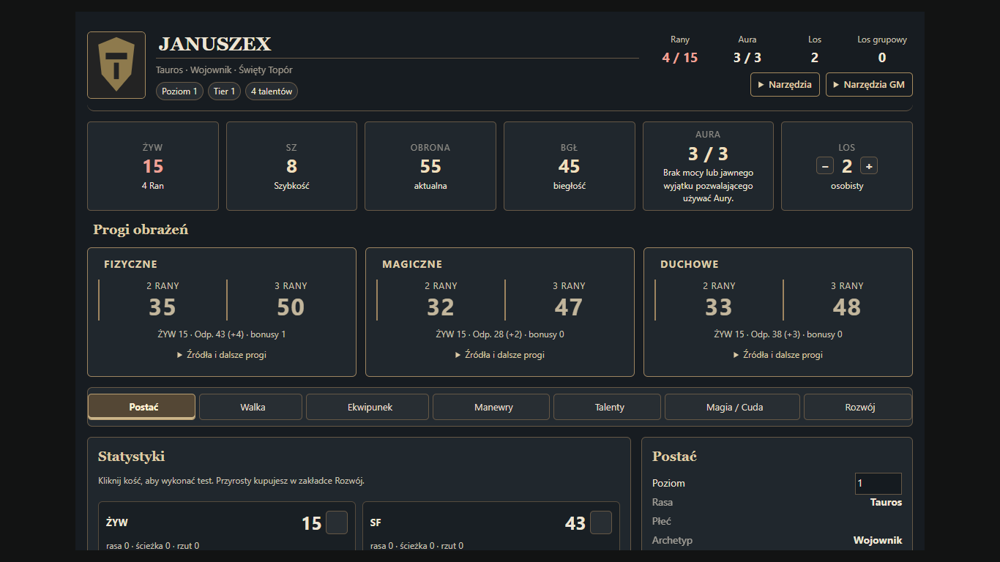
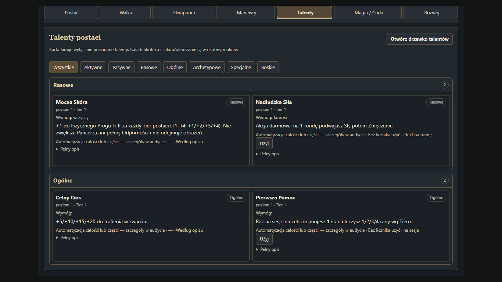

# Gahla Resurrected 0.11.7-beta — raport

Data: 2026-10-08. Baza: ukończony ZIP 0.11.6-beta, nie 0.9.6 ani 0.11.0. Manifest podniesiony o jeden patch. Dotychczasowe funkcje walki, magii, run, rozwoju, generatorów i logów zachowane.

## Zmiany zasad i ich wykonanie

- **Odporność:** pełna wartość pozostaje celem testu. Do właściwych progów trafia floor(Odporność/10). Wynik obrażeń nie jest pomniejszany o odporność, również u przeciwników na HP. Wyłączono użycie historycznych pól FlatDR, zachowując zapisane dane. Pancerz i Aura nadal działają według dotychczasowych zasad.
- **Mocna Skóra:** dawna płaska redukcja → +Tier postaci do Fizycznego Progu I i II. Jeden poziom zakupu; darmowe nadanie przez Jestestwo Taurosa/Krasnoluda/Erusanina zachowane. Bez premii do Pancerza i pełnej Odporności.
- **Naturalna Obrona:** dawne uniwersalne +1/+2/+3/+3 oraz płaska redukcja 2×poziom → +1/+2/+3/+4 tylko do Fizycznych Progów. T4 raz na rundę Ułatwienie do testu Odp. Fiz. przeciw stanowi z otrzymanego trafienia. Przycisk i propozycja w rozliczeniu stanu; deklaracja przed rzutem, zwrot użycia po anulowaniu/błędzie.
- **Bestialska Hybryda T4:** brak wykonawcy → przycisk dla MG, 2 rundy ignorowania kar Zmęczenia/Krwawienia i ×2 wyłącznie dla bonusu progów z dziesiątek Odp. Fiz. Zgodnie z zatwierdzeniem użytkownika brak nowego kosztu lub limitu użyć. Do odliczania rund potrzebna rozpoczęta walka. Stany pozostają zapisane i po wygaśnięciu znów działają.
- **Święty Płomień:** sama zniżka Ognia → zniżka oraz pominięcie wyłącznie duchowego bonusu progów przy Cudzie Ognia Gidy przeciw Istocie Mroku. MG oznacza cel w Narzędziach GM; system nie zgaduje po rasie. Inne składniki progów, Pancerz i aktywne testy pozostają.
- **Odporny Fizycznie/Psychicznie/Magicznie/Duchowo:** +5/+10/+15/+20 zachowane, naprawiona kolejność naliczania w modelu. Premie wcześniej nie docierały do wynikowej odporności.
- **Serce Burzy:** stałe +10 Odp. Fiz. ma wykonawcę; części pogodowe/sytuacyjne pozostają ręczne. **Mocne Kości:** dodane brakujące +1/+1/+2/+2 do progów.
- **Celny Cios:** +5/+10/+15/+20 było widoczne w wyliczeniu karty, ale pomijane przez atak. Premia trafia teraz do rzutu wręcz raz; nie działa na dystans. Wartości nie zmieniono.
- **Legalność:** WIP i Special Features Świętego Rycerza nie należą do normalnej puli zakupów; pozostają w katalogu po pokazaniu wszystkich i na kartach już posiadających dokument. Bezpośredni zakup również blokowany. WIP nie otrzymały wymyślonych efektów.

Przykład: ŻYW 15, Odp. Fiz. 43 → Progi 34/49; dodatkowa Mocna Skóra na Tierze 1 → 35/50. Pełny test nadal ma bazę 43. Hybryda zmienia +4 z odporności na +8, a nie mnoży ŻYW ani innych bonusów.

Zachowane są wcześniejsze granice pasm Ran, w tym pasmo zerowe do bonusu z odporności oraz brak standardowych 4 Ran. To porównanie z progiem, nie odejmowanie od pokazanego wyniku obrażeń. Wyższe pasma wynikają z dotychczasowej funkcji thresholdWounds.

## UI i obsługa

Ciemne panele, złote obramowania, pergaminowy tekst i czerwone Rany. Kompaktowy nagłówek z tożsamością, poziomem/Tierem i zasobami. Sześć dużych kart: ŻYW, SZ, Obrona, BGŁ, Aura, Los. Trzy czytelne karty progów pokazują osobno 2 Rany i 3 Rany oraz rozwijane źródła i pasma 5/6/7 Ran. Progi pozostają wspólne dla zakładek. W bardzo wąskim oknie układają się pionowo.

Narzędzia i Narzędzia GM zastąpiły powtarzające się globalne skróty. Usunięto panel Szybkich akcji i wstrzykiwany pasek. Kontekstowe akcje przy broni, zaklęciu, talencie i w Rozwoju pozostają. Audyt oraz narzędzia MG mają sprawdzenie uprawnień także przy wykonaniu. Kreator magii w menu uwzględnia mosty i posiadane zaklęcia. Aktywne talenty można przeciągnąć z karty na hotbar. Filtry talentów: aktywne, pasywne, rasowe, ogólne, archetypowe, specjalne, boskie.

Statystyki w dwóch kolumnach, tożsamość obok, pochodne niżej. Zachowany brak plusów przy statystykach; EXP jest w Rozwoju. Zakładka i przewinięcie zachowują pozycję po odświeżeniu.

Kreator Zaklęć/Cudów zachowuje wcześniejsze sekcje, zniżki i walidację. Test sprawdził przeliczanie kosztów, 24 dodatkowe kontrolki, brak ich duplikowania, blokadę nielegalnego projektu i ponowne odblokowanie po poprawieniu danych. Nie cofano funkcji 0.11.

## Audyt

[Każdy z 169 wpisów talentów](TALENT-AUDIT-0.11.7.md) ma dawny/obecny opis, wymagania, maksymalny poziom, bazę EXP, uwagi, zakres automatyzacji i status. Wynik: 14 ZMIENIONY, 152 OK — zasady zachowane, 3 WIP, 0 USUNIĘTY. OK nie oznacza, że każdy fabularny/sytuacyjny efekt ma pełny automat. [Audyt przycisków](UI-AUDIT-0.11.7.md) zawiera liczniki przed/po i mapę przeniesienia.

Nie zwiększono automatycznie żadnego +5 do +10. Nieustępliwość Tępiciela, Sanktuarium Eruela i Nosiciel Niegodziwości zachowują bonusy do pełnych testów, a ich niedookreślone lub sytuacyjne warunki opisano w audycie. Runy zachowują zatwierdzone koszty, CF i bezpośrednie Rany po porażce wszczepienia.

## Migracja i zachowanie danych

Po wejściu MG uruchamia się idempotentna migracja po wcześniejszych migracjach. Aktualizuje cztery zmienione opisy talentów oraz trzy Jestestwa, maksymalne poziomy i migawki w historii rozwoju. Zachowuje ID, aktualne poziomy, EXP i możliwość cofania zakupów. Poprzedni opis/maxLevel zapisuje w flags.gahla-resurrected.talent117Previous, również dla własnych zmienionych opisów tych nazw.

Obejmuje przedmioty świata, aktorów, niepowiązane tokeny oraz kompendia Item/Actor należące do świata lub systemu. Kompendium odblokowywane tylko na czas zapisu, a poprzednia blokada wraca także po błędzie. Kompendia innych modułów pozostają ich własnością; importowany Item jest poprawiany przy tworzeniu. Schemat API kompendiów sprawdzono w [dokumentacji Foundry V14](https://foundryvtt.com/api/v14/classes/foundry.documents.collections.CompendiumCollection.html).

Starsze nadmiarowe zakupy Mocnej Skóry nie znikają i nie generują samowolnego zwrotu EXP. Audyt może je zgłosić MG. Historyczne FlatDR pozostają w danych, lecz nie zmniejszają obrażeń. Przy błędzie migracji pojawia się komunikat i można ją wznowić ponownym uruchomieniem świata.

## Testy i ich ograniczenia

- 39/39 zestawów regresji mechaniki: PASS. Pełna lista w TEST-RESULTS-0.11.7.txt.
- 5/5 skryptów przeglądarkowych: PASS. Kreator; reakcja między dwoma klientami; generator; karta; wszystkie szablony/CSS.
- 11/11 szablonów Handlebars: kompilacja i pojedynczy główny element HTML: PASS. Nie jest to sprawdzenie każdej możliwej gałęzi danych.
- CSS: Edge wczytuje 807 reguł najwyższego poziomu; sprawdzone układy bez poziomego przepełnienia. To test parsowania i układu, nie pełna walidacja standardu CSS.
- Karta: 1920×1080, 1366×768, 900×768 i 700×900, szerokość karty do 1160 px; rozmiar cyfr progów co najmniej 26 px. Filtry, menu MG, blokada wykonania audytu przez gracza, most magii, hotbar i zachowanie scrolla: PASS.
- Kreator: szerokości 1200/760/480 px. Reakcja/czat: 280 px. Bez błędów JS strony w testach interakcji.
- Migracje: dokumenty świata/tokenów/kompendiów, blokady, ponowne uruchomienie i cofanie zakupu: PASS.

Naprawione problemy podczas testów: test starego wyglądu progów oczekiwał usuniętych chipsów (zastąpiony testem pełnego nowego szablonu); fixture filtra pomijał aktywną Pierwszą Pomoc; środowisko testowe wymagało Handlebars i helpera array. To były błędy testowego przygotowania/oczekiwań, nie ukryte końcowe FAIL. Celny Cios był rzeczywistym znalezionym błędem wykonania i został naprawiony. Końcowych znanych FAIL w uruchomionych testach: 0.

**Nie uruchomiono licencjonowanego serwera Foundry V14 ani migracji na rzeczywistym świecie użytkownika.** Testy przeglądarkowe używają prawdziwego DOM, szablonów i kodu modułów z atrapami API Foundry. Nie stanowią gwarancji zgodności ze wszystkimi modułami użytkownika. Zrzuty przedstawiają tę lokalną prezentację rzeczywistego szablonu; Font Awesome i obramowanie okna Foundry nie są odtworzone. Pole verified manifestu jest odziedziczone z bazy, nie jest nowym certyfikatem pełnego testu VTT.

## Osobne sugestie — niewdrożone

1. Uściślić skalowanie Nieustępliwości Tępiciela i Sanktuarium Eruela; dotąd nie dopisywać tabel Tierów.
2. Rozstrzygnąć starszą rozbieżność połowicznej przemiany Theriana i bonusu BGŁ Szkolenia Mnicha poza walką bez broni.
3. Ustalić progresję/zakup poziomów bez nowej korzyści w skróconych opisach (np. Mocne Kości T2/T4, cechy +5 na T1 i T3).
4. Dodać osobny wybór rodzajów broni Mistrza Broni i pełne wykonawce sytuacyjnych talentów opisanych jako ręczne w audycie.
5. Zachowane wcześniejsze WIP, w tym rozliczenie dodatkowych obrażeń Wielostrzału, nie otrzymały automatycznie nowych zasad.

## Zrzuty

Pozostałe rozmiary w katalogu screenshots.

## Instalacja

Rozpakuj zawartość ZIP do Data/systems/gahla-resurrected tak, by system.json był bezpośrednio w tym katalogu. Uruchom ponownie Foundry, otwórz świat jako MG i pozwól zakończyć migracje. Pliki świata użytkownika nie były modyfikowane podczas przygotowania wydania.
