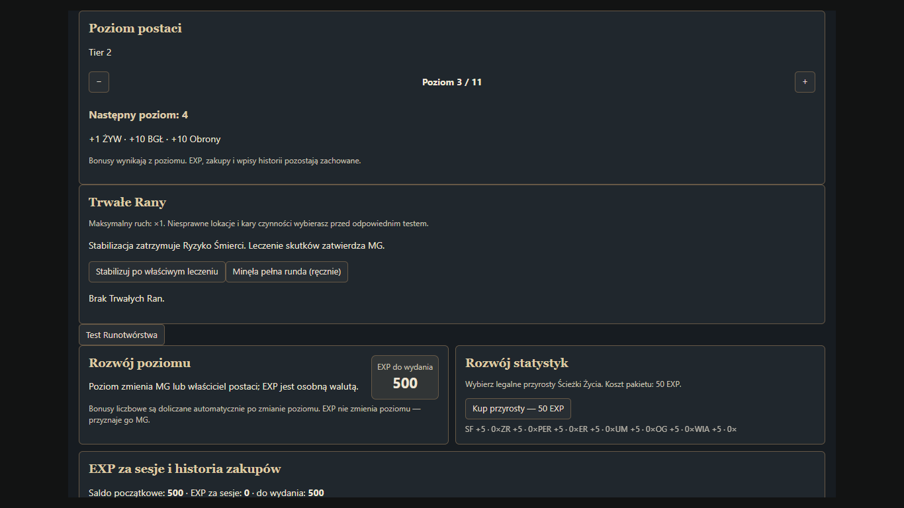
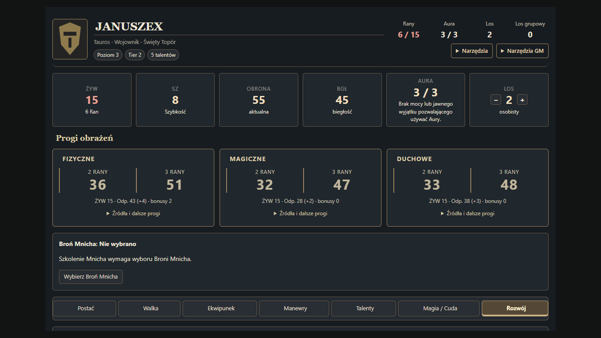

# Raport 0.11.8-beta — Progression & Talent Cleanup

## Baza i granice zmian

Baza: ukończony Gahla-Resurrected-Foundry-V14-0.11.7-beta.zip, 710263 bajty, 136 plików, SHA256 c503c4ecb95e1e9d1ec73aaf8fff3292827e9e2c55a26b48cb40839a3b7d8f11. Zachowano wcześniejsze migracje i funkcje. Baza miała 39 zestawów regresji i 5 skryptów przeglądarkowych; teraz 43 i 6. Poprawiono wyłącznie wskazany rozwój, rangowanie i talenty oraz potrzebne połączenia z atakiem/migracją. CSS i główny układ karty pozostają z 0.11.7.

## Faktycznie wykonane zmiany

- Rozwój: zmiana poziomu 1–11 dla Ownera/MG, automatyczny Tier i bonusy, podgląd następnego poziomu, potwierdzenie obniżenia, skróty przy poziomach 3/6/11. EXP i historia pozostają.
- Talenty: osobne rank / requiredTier / costLevel / effectTier. Druga realna ranga T3 zachowuje cenę ×3. Usunięte nowe zakupy pustych stopni w rozstrzygniętych progresjach; niezdefiniowane dalsze rangi wymagają decyzji.
- Osobne talenty Kartograf, Sztuka Rysunku, Poliglota zgodnie z zatwierdzonymi efektami. Rozdzielono też potwierdzone dawne zbiory umiejętności i przerzutów.
- Mnich: jednorazowy wybór profilu broni wręcz, korekta tylko MG. +20/+30 BGŁ wyłącznie unarmed/wybrana broń, +1k10 wyłącznie unarmed. Ostrzeżenie i wybór dla istniejących Mnichów.
- Naturalna Obrona: progi fizyczne +2/+4/+6/+8 oraz pełna odporność +0/+5/+5/+10, zachowane użycie T4 raz/rundę.
- Nadludzka Siła: 1/walkę; Zmęczenie również przy końcu walki.
- Hybryda T4: Owner/MG, 1/walkę, 2 rundy, wymagana aktywna forma; kończy się wraz z formą.
- Migracja zachowuje XP, pierwszy ID rozdzielonego Itemu, historię i cofanie. Historyczne puste zakupy trafiają do audytu, bez automatycznego refundu.
- Audyt: 177 odrębnych wpisów, rozdzielone oceny mechaniki i automatyzacji. Runotwórstwo pozostaje bez zmiany wzoru.

## Poziom postaci

Jedynym źródłem bonusów jest system.level. Istniejący DataModel wylicza ŻYW L−1, BGŁ i Obronę 10×(L−1), SZ na 3/6/11; nie zapisuje się ich ponownie do bazy. Tier: L1→1, L2–4→2, L5–7→3, L8–11→4. Uprawnienia sprawdzane są w wykonawcy akcji, nie tylko przyciskiem. Obniżenie wymaga potwierdzenia i ostrzega przy spadku Tieru. Talenty, EXP, Doświadczenia i Cechy Specjalne pozostają. Dotychczasowy mechanizm tworzy pola do uzupełnienia na 3/6/11 bez duplikacji po ponownym wejściu na poziom. Skróty dialogu prowadzą do właściwych pól po przywróceniu przewinięcia.

Zrzuty pochodzą z rzeczywistego szablonu i kontekstu karty uruchomionych w przeglądarce, z testowym aktorem i zastąpionym cyklem dokumentów Foundry. Nie są zrzutami kampanii użytkownika.

## Rangi, cena i cofanie

rank = rzeczywisty numer zakupu; requiredTier = minimalny Tier postaci; costLevel = mnożnik EXP; effectTier = dawny stopień efektu. Pole system.level na talencie pozostaje kompatybilnym odpowiednikiem effectTier, aby starsze wykonawce nie pomyliły R2 z efektem T2. Wymagania nazwanych talentów sprawdzają effectTier. Drzewko i panel Rozwoju wyświetlają oddzielnie rangę, Tier i cenę.

Cofnięcie oddaje dokładnie zapisany wydatek, w tym zastosowany rabat nauczyciela, zamiast mnożyć cenę przez numer rangi. Stary zapłacony pusty stopień oznaczany jest tylko przy potwierdzającej go historii zakupu; bez automatycznego zwrotu. Istniejące niepełne progresje zachowano, ale nie pozwala się kupić ich kolejnych nieopisanych rang. Nie oznacza to ukończenia WIP.

Poniżej wszystkie krótsze progresje (także istniejące jednorangowe i trójrangowe); czterostopniowe premie jak Odporności, Naturalna Obrona, Wytrzymały, Runotwórstwo zachowują cztery rangi. Tabele kosztu nie znoszą ograniczeń dostępu, WIP ani zakazu kupowania Cech Specjalnych za EXP.

### Widzenie w Ciemności

| Ranga | effectTier | requiredTier | costLevel | EXP bez nauczyciela |
|---:|---:|---:|---:|---:|
| 1 | 1 | 1 | 1 | 50 |

### Mocna Skóra

| Ranga | effectTier | requiredTier | costLevel | EXP bez nauczyciela |
|---:|---:|---:|---:|---:|
| 1 | 1 | 1 | 1 | 50 |

### Nadludzka Siła

| Ranga | effectTier | requiredTier | costLevel | EXP bez nauczyciela |
|---:|---:|---:|---:|---:|
| 1 | 1 | 1 | 1 | 50 |

### Szarża Taurosa

| Ranga | effectTier | requiredTier | costLevel | EXP bez nauczyciela |
|---:|---:|---:|---:|---:|
| 1 | 1 | 1 | 1 | 50 |

### Silnoręki

| Ranga | effectTier | requiredTier | costLevel | EXP bez nauczyciela |
|---:|---:|---:|---:|---:|
| 1 | 1 | 1 | 1 | 50 |

### Niezłomna Postawa

| Ranga | effectTier | requiredTier | costLevel | EXP bez nauczyciela |
|---:|---:|---:|---:|---:|
| 1 | 1 | 1 | 1 | 50 |

### Podziemne Zmysły

| Ranga | effectTier | requiredTier | costLevel | EXP bez nauczyciela |
|---:|---:|---:|---:|---:|
| 1 | 1 | 1 | 1 | 50 |

### Wszechstronny

| Ranga | effectTier | requiredTier | costLevel | EXP bez nauczyciela |
|---:|---:|---:|---:|---:|
| 1 | 1 | 1 | 1 | 50 |

### Zmysł Przyrody

| Ranga | effectTier | requiredTier | costLevel | EXP bez nauczyciela |
|---:|---:|---:|---:|---:|
| 1 | 1 | 1 | 1 | 50 |

### Cztery Ręce

| Ranga | effectTier | requiredTier | costLevel | EXP bez nauczyciela |
|---:|---:|---:|---:|---:|
| 1 | 1 | 1 | 1 | 50 |
| 2 | 3 | 3 | 3 | 150 |

### Ciało Cienia

| Ranga | effectTier | requiredTier | costLevel | EXP bez nauczyciela |
|---:|---:|---:|---:|---:|
| 1 | 1 | 1 | 1 | 50 |

### Ciało Światła

| Ranga | effectTier | requiredTier | costLevel | EXP bez nauczyciela |
|---:|---:|---:|---:|---:|
| 1 | 1 | 1 | 1 | 50 |

### Bestialska Hybryda

| Ranga | effectTier | requiredTier | costLevel | EXP bez nauczyciela |
|---:|---:|---:|---:|---:|
| 1 | 1 | 1 | 1 | 50 |
| 2 | 4 | 4 | 4 | 200 |

### Mocne Kości

| Ranga | effectTier | requiredTier | costLevel | EXP bez nauczyciela |
|---:|---:|---:|---:|---:|
| 1 | 1 | 1 | 1 | 50 |
| 2 | 3 | 3 | 3 | 150 |

### Czytanie/Pisanie

| Ranga | effectTier | requiredTier | costLevel | EXP bez nauczyciela |
|---:|---:|---:|---:|---:|
| 1 | 1 | 1 | 1 | 50 |

### Medycyna Zaawansowana

| Ranga | effectTier | requiredTier | costLevel | EXP bez nauczyciela |
|---:|---:|---:|---:|---:|
| 1 | 1 | 2 | 1 | 50 |
| 2 | 3 | 3 | 3 | 150 |

### Heraldyka / Etykieta

| Ranga | effectTier | requiredTier | costLevel | EXP bez nauczyciela |
|---:|---:|---:|---:|---:|
| 1 | 1 | 1 | 1 | 50 |

### Nienaturalnie Odporny

| Ranga | effectTier | requiredTier | costLevel | EXP bez nauczyciela |
|---:|---:|---:|---:|---:|
| 1 | 1 | 2 | 1 | 50 |
| 2 | 3 | 3 | 3 | 150 |
| 3 | 4 | 4 | 4 | 200 |

### Wnikliwość

| Ranga | effectTier | requiredTier | costLevel | EXP bez nauczyciela |
|---:|---:|---:|---:|---:|
| 1 | 1 | 1 | 1 | 50 |
| 2 | 3 | 3 | 3 | 150 |

### Większa Muskulatura

| Ranga | effectTier | requiredTier | costLevel | EXP bez nauczyciela |
|---:|---:|---:|---:|---:|
| 1 | 1 | 1 | 1 | 50 |
| 2 | 3 | 3 | 3 | 150 |

### Gibkość

| Ranga | effectTier | requiredTier | costLevel | EXP bez nauczyciela |
|---:|---:|---:|---:|---:|
| 1 | 1 | 1 | 1 | 50 |
| 2 | 3 | 3 | 3 | 150 |

### Uczony

| Ranga | effectTier | requiredTier | costLevel | EXP bez nauczyciela |
|---:|---:|---:|---:|---:|
| 1 | 1 | 1 | 1 | 50 |
| 2 | 3 | 3 | 3 | 150 |

### Większa Ogłada

| Ranga | effectTier | requiredTier | costLevel | EXP bez nauczyciela |
|---:|---:|---:|---:|---:|
| 1 | 1 | 1 | 1 | 50 |
| 2 | 3 | 3 | 3 | 150 |

### Potencjał Magiczny

| Ranga | effectTier | requiredTier | costLevel | EXP bez nauczyciela |
|---:|---:|---:|---:|---:|
| 1 | 1 | 1 | 1 | 50 |
| 2 | 3 | 3 | 3 | 150 |

### Potencjał Duchowy

| Ranga | effectTier | requiredTier | costLevel | EXP bez nauczyciela |
|---:|---:|---:|---:|---:|
| 1 | 1 | 1 | 1 | 50 |
| 2 | 3 | 3 | 3 | 150 |

### Odporność na Klimat

| Ranga | effectTier | requiredTier | costLevel | EXP bez nauczyciela |
|---:|---:|---:|---:|---:|
| 1 | 1 | 1 | 1 | 50 |
| 2 | 2 | 2 | 2 | 100 |

### Mocne Płuca

| Ranga | effectTier | requiredTier | costLevel | EXP bez nauczyciela |
|---:|---:|---:|---:|---:|
| 1 | 1 | 1 | 1 | 50 |

### Pływak

| Ranga | effectTier | requiredTier | costLevel | EXP bez nauczyciela |
|---:|---:|---:|---:|---:|
| 1 | 1 | 1 | 1 | 50 |
| 2 | 3 | 3 | 3 | 150 |

### Wspinacz

| Ranga | effectTier | requiredTier | costLevel | EXP bez nauczyciela |
|---:|---:|---:|---:|---:|
| 1 | 1 | 1 | 1 | 50 |
| 2 | 3 | 3 | 3 | 150 |

### Kowal własnego Losu

| Ranga | effectTier | requiredTier | costLevel | EXP bez nauczyciela |
|---:|---:|---:|---:|---:|
| 1 | 1 | 1 | 1 | 50 |

### Naturalna Ochrona Trucizny

| Ranga | effectTier | requiredTier | costLevel | EXP bez nauczyciela |
|---:|---:|---:|---:|---:|
| 1 | 1 | 1 | 1 | 50 |
| 2 | 4 | 4 | 4 | 200 |

### Niezmordowany

| Ranga | effectTier | requiredTier | costLevel | EXP bez nauczyciela |
|---:|---:|---:|---:|---:|
| 1 | 1 | 1 | 1 | 50 |
| 2 | 3 | 3 | 3 | 150 |

### Zwinność Akrobaty

| Ranga | effectTier | requiredTier | costLevel | EXP bez nauczyciela |
|---:|---:|---:|---:|---:|
| 1 | 1 | 1 | 1 | 50 |

### Otwieranie Zamków

| Ranga | effectTier | requiredTier | costLevel | EXP bez nauczyciela |
|---:|---:|---:|---:|---:|
| 1 | 1 | 2 | 1 | 50 |

### Rozbrajanie Pułapek

| Ranga | effectTier | requiredTier | costLevel | EXP bez nauczyciela |
|---:|---:|---:|---:|---:|
| 1 | 1 | 1 | 1 | 50 |

### Kartograf

| Ranga | effectTier | requiredTier | costLevel | EXP bez nauczyciela |
|---:|---:|---:|---:|---:|
| 1 | 1 | 1 | 1 | 50 |
| 2 | 3 | 3 | 3 | 150 |

### Sztuka Rysunku

| Ranga | effectTier | requiredTier | costLevel | EXP bez nauczyciela |
|---:|---:|---:|---:|---:|
| 1 | 1 | 1 | 1 | 50 |
| 2 | 3 | 3 | 3 | 150 |

### Poliglota

| Ranga | effectTier | requiredTier | costLevel | EXP bez nauczyciela |
|---:|---:|---:|---:|---:|
| 1 | 1 | 1 | 1 | 50 |
| 2 | 3 | 3 | 3 | 150 |

### Sztuka Kulinarna

| Ranga | effectTier | requiredTier | costLevel | EXP bez nauczyciela |
|---:|---:|---:|---:|---:|
| 1 | 1 | 1 | 1 | 50 |
| 2 | 3 | 3 | 3 | 150 |

### Zielarstwo

| Ranga | effectTier | requiredTier | costLevel | EXP bez nauczyciela |
|---:|---:|---:|---:|---:|
| 1 | 1 | 1 | 1 | 50 |
| 2 | 3 | 3 | 3 | 150 |

### Opanowanie Instrumentu

| Ranga | effectTier | requiredTier | costLevel | EXP bez nauczyciela |
|---:|---:|---:|---:|---:|
| 1 | 1 | 1 | 1 | 50 |
| 2 | 3 | 3 | 3 | 150 |

### Uzdolnienie Artystyczne

| Ranga | effectTier | requiredTier | costLevel | EXP bez nauczyciela |
|---:|---:|---:|---:|---:|
| 1 | 1 | 1 | 1 | 50 |
| 2 | 3 | 3 | 3 | 150 |

### Znawca Bestii

| Ranga | effectTier | requiredTier | costLevel | EXP bez nauczyciela |
|---:|---:|---:|---:|---:|
| 1 | 1 | 1 | 1 | 50 |
| 2 | 3 | 3 | 3 | 150 |

### Strateg

| Ranga | effectTier | requiredTier | costLevel | EXP bez nauczyciela |
|---:|---:|---:|---:|---:|
| 1 | 1 | 1 | 1 | 50 |
| 2 | 3 | 3 | 3 | 150 |

### Znawca Rynku

| Ranga | effectTier | requiredTier | costLevel | EXP bez nauczyciela |
|---:|---:|---:|---:|---:|
| 1 | 1 | 1 | 1 | 50 |
| 2 | 3 | 3 | 3 | 150 |

### Łamacz Zbroi

| Ranga | effectTier | requiredTier | costLevel | EXP bez nauczyciela |
|---:|---:|---:|---:|---:|
| 1 | 2 | 2 | 2 | 100 |
| 2 | 3 | 3 | 3 | 150 |
| 3 | 4 | 4 | 4 | 200 |

### Doświadczenie Magiczne / Kapłańskie

| Ranga | effectTier | requiredTier | costLevel | EXP bez nauczyciela |
|---:|---:|---:|---:|---:|
| 1 | 1 | 1 | 1 | 100 |
| 2 | 3 | 3 | 3 | 300 |

### Żelazne Natarcie

| Ranga | effectTier | requiredTier | costLevel | EXP bez nauczyciela |
|---:|---:|---:|---:|---:|
| 1 | 1 | 3 | 1 | 100 |

### Kontrolowana Sekwencja

| Ranga | effectTier | requiredTier | costLevel | EXP bez nauczyciela |
|---:|---:|---:|---:|---:|
| 1 | 3 | 3 | 3 | 300 |
| 2 | 4 | 4 | 4 | 400 |

### Mocny Cios

| Ranga | effectTier | requiredTier | costLevel | EXP bez nauczyciela |
|---:|---:|---:|---:|---:|
| 1 | 1 | 1 | 1 | 100 |

### Precyzyjny Strzał

| Ranga | effectTier | requiredTier | costLevel | EXP bez nauczyciela |
|---:|---:|---:|---:|---:|
| 1 | 1 | 1 | 1 | 100 |

### Wojak

| Ranga | effectTier | requiredTier | costLevel | EXP bez nauczyciela |
|---:|---:|---:|---:|---:|
| 1 | 1 | 3 | 1 | 100 |

### Śmiertelny Cios

| Ranga | effectTier | requiredTier | costLevel | EXP bez nauczyciela |
|---:|---:|---:|---:|---:|
| 1 | 1 | 2 | 1 | 100 |

### Doświadczony Wojak

| Ranga | effectTier | requiredTier | costLevel | EXP bez nauczyciela |
|---:|---:|---:|---:|---:|
| 1 | 1 | 1 | 1 | 100 |
| 2 | 3 | 3 | 3 | 300 |

### Doświadczenie Strzelca

| Ranga | effectTier | requiredTier | costLevel | EXP bez nauczyciela |
|---:|---:|---:|---:|---:|
| 1 | 1 | 1 | 1 | 100 |
| 2 | 3 | 3 | 3 | 300 |

### Szybki Refleks

| Ranga | effectTier | requiredTier | costLevel | EXP bez nauczyciela |
|---:|---:|---:|---:|---:|
| 1 | 1 | 1 | 1 | 100 |

### Szybka Wymiana

| Ranga | effectTier | requiredTier | costLevel | EXP bez nauczyciela |
|---:|---:|---:|---:|---:|
| 1 | 1 | 2 | 1 | 100 |

### Przycelowanie

| Ranga | effectTier | requiredTier | costLevel | EXP bez nauczyciela |
|---:|---:|---:|---:|---:|
| 1 | 1 | 1 | 1 | 100 |

### Sokole Oko

| Ranga | effectTier | requiredTier | costLevel | EXP bez nauczyciela |
|---:|---:|---:|---:|---:|
| 1 | 3 | 3 | 3 | 300 |

### Wielostrzał

| Ranga | effectTier | requiredTier | costLevel | EXP bez nauczyciela |
|---:|---:|---:|---:|---:|
| 1 | 3 | 3 | 3 | 300 |
| 2 | 4 | 4 | 4 | 400 |

### Akrobatyczny Unik

| Ranga | effectTier | requiredTier | costLevel | EXP bez nauczyciela |
|---:|---:|---:|---:|---:|
| 1 | 1 | 1 | 1 | 100 |

### Blokada Aury

| Ranga | effectTier | requiredTier | costLevel | EXP bez nauczyciela |
|---:|---:|---:|---:|---:|
| 1 | 1 | 1 | 1 | 100 |

### Szkolenie Mnicha

| Ranga | effectTier | requiredTier | costLevel | EXP bez nauczyciela |
|---:|---:|---:|---:|---:|
| 1 | 1 | 1 | 1 | 100 |
| 2 | 2 | 2 | 2 | 200 |

### Magiczne Manewry

| Ranga | effectTier | requiredTier | costLevel | EXP bez nauczyciela |
|---:|---:|---:|---:|---:|
| 1 | 1 | 2 | 1 | 100 |

### Mistrz Run

| Ranga | effectTier | requiredTier | costLevel | EXP bez nauczyciela |
|---:|---:|---:|---:|---:|
| 1 | 3 | 3 | 3 | 300 |

### Krok Widma

| Ranga | effectTier | requiredTier | costLevel | EXP bez nauczyciela |
|---:|---:|---:|---:|---:|
| 1 | 1 | 1 | 1 | 100 |

### Wybraniec Boży

| Ranga | effectTier | requiredTier | costLevel | EXP bez nauczyciela |
|---:|---:|---:|---:|---:|
| 1 | 1 | 1 | 1 | 100 |

### Święty Wojownik

| Ranga | effectTier | requiredTier | costLevel | EXP bez nauczyciela |
|---:|---:|---:|---:|---:|
| 1 | 1 | 1 | 1 | 100 |

### Błogosławiony

| Ranga | effectTier | requiredTier | costLevel | EXP bez nauczyciela |
|---:|---:|---:|---:|---:|
| 1 | 1 | 1 | 1 | 100 |

### Niosący Sprawiedliwość

| Ranga | effectTier | requiredTier | costLevel | EXP bez nauczyciela |
|---:|---:|---:|---:|---:|
| 1 | 1 | 1 | 1 | 100 |

### Święty Płomień

| Ranga | effectTier | requiredTier | costLevel | EXP bez nauczyciela |
|---:|---:|---:|---:|---:|
| 1 | 1 | 1 | 1 | 100 |

### Wola Życia

| Ranga | effectTier | requiredTier | costLevel | EXP bez nauczyciela |
|---:|---:|---:|---:|---:|
| 1 | 1 | 1 | 1 | 100 |

### Dotyk Litości

| Ranga | effectTier | requiredTier | costLevel | EXP bez nauczyciela |
|---:|---:|---:|---:|---:|
| 1 | 1 | 1 | 1 | 100 |

### Płomyk Nadziei

| Ranga | effectTier | requiredTier | costLevel | EXP bez nauczyciela |
|---:|---:|---:|---:|---:|
| 1 | 1 | 1 | 1 | 100 |

### Głos Otuchy

| Ranga | effectTier | requiredTier | costLevel | EXP bez nauczyciela |
|---:|---:|---:|---:|---:|
| 1 | 1 | 1 | 1 | 100 |

### Niezłomna Wiara

| Ranga | effectTier | requiredTier | costLevel | EXP bez nauczyciela |
|---:|---:|---:|---:|---:|
| 1 | 1 | 1 | 1 | 100 |

### Spojrzenie Herolda

| Ranga | effectTier | requiredTier | costLevel | EXP bez nauczyciela |
|---:|---:|---:|---:|---:|
| 1 | 1 | 1 | 1 | 100 |

### Serce Burzy

| Ranga | effectTier | requiredTier | costLevel | EXP bez nauczyciela |
|---:|---:|---:|---:|---:|
| 1 | 1 | 1 | 1 | 100 |

### Gniew Burzy

| Ranga | effectTier | requiredTier | costLevel | EXP bez nauczyciela |
|---:|---:|---:|---:|---:|
| 1 | 1 | 1 | 1 | 100 |

### Pewny Krok

| Ranga | effectTier | requiredTier | costLevel | EXP bez nauczyciela |
|---:|---:|---:|---:|---:|
| 1 | 1 | 1 | 1 | 100 |

### Rytuał Dwoistości

| Ranga | effectTier | requiredTier | costLevel | EXP bez nauczyciela |
|---:|---:|---:|---:|---:|
| 1 | 1 | 1 | 1 | 100 |

### Purpurowa Maska

| Ranga | effectTier | requiredTier | costLevel | EXP bez nauczyciela |
|---:|---:|---:|---:|---:|
| 1 | 1 | 1 | 1 | 100 |

### Kielich Rozpusty

| Ranga | effectTier | requiredTier | costLevel | EXP bez nauczyciela |
|---:|---:|---:|---:|---:|
| 1 | 1 | 1 | 1 | 100 |

### Taniec Satyra

| Ranga | effectTier | requiredTier | costLevel | EXP bez nauczyciela |
|---:|---:|---:|---:|---:|
| 1 | 1 | 1 | 1 | 100 |

### Ziarna Czasu

| Ranga | effectTier | requiredTier | costLevel | EXP bez nauczyciela |
|---:|---:|---:|---:|---:|
| 1 | 1 | 1 | 1 | 100 |

### Pętla Przeznaczenia

| Ranga | effectTier | requiredTier | costLevel | EXP bez nauczyciela |
|---:|---:|---:|---:|---:|
| 1 | 1 | 1 | 1 | 100 |

### Spojrzenie w Przyszłość

| Ranga | effectTier | requiredTier | costLevel | EXP bez nauczyciela |
|---:|---:|---:|---:|---:|
| 1 | 1 | 1 | 1 | 100 |

### Głos Wyroczni

| Ranga | effectTier | requiredTier | costLevel | EXP bez nauczyciela |
|---:|---:|---:|---:|---:|
| 1 | 1 | 1 | 1 | 100 |

### Nić Przeznaczenia

| Ranga | effectTier | requiredTier | costLevel | EXP bez nauczyciela |
|---:|---:|---:|---:|---:|
| 1 | 1 | 1 | 1 | 100 |

### Honor Wojownika

| Ranga | effectTier | requiredTier | costLevel | EXP bez nauczyciela |
|---:|---:|---:|---:|---:|
| 1 | 1 | 1 | 1 | 100 |

### Jedność z Naturą

| Ranga | effectTier | requiredTier | costLevel | EXP bez nauczyciela |
|---:|---:|---:|---:|---:|
| 1 | 1 | 1 | 1 | 100 |

### Szept Puszczy

| Ranga | effectTier | requiredTier | costLevel | EXP bez nauczyciela |
|---:|---:|---:|---:|---:|
| 1 | 1 | 1 | 1 | 100 |

### Skóra jak Kora

| Ranga | effectTier | requiredTier | costLevel | EXP bez nauczyciela |
|---:|---:|---:|---:|---:|
| 1 | 1 | 1 | 1 | 100 |
| 2 | 2 | 2 | 2 | 200 |
| 3 | 3 | 3 | 3 | 300 |

### Rytualna Ofiara

| Ranga | effectTier | requiredTier | costLevel | EXP bez nauczyciela |
|---:|---:|---:|---:|---:|
| 1 | 1 | 1 | 1 | 100 |

### Krwawe Przymierze

| Ranga | effectTier | requiredTier | costLevel | EXP bez nauczyciela |
|---:|---:|---:|---:|---:|
| 1 | 1 | 1 | 1 | 100 |

### Sługa Martwego Oblicza

| Ranga | effectTier | requiredTier | costLevel | EXP bez nauczyciela |
|---:|---:|---:|---:|---:|
| 1 | 1 | 1 | 1 | 100 |

### Szept zza Grobu

| Ranga | effectTier | requiredTier | costLevel | EXP bez nauczyciela |
|---:|---:|---:|---:|---:|
| 1 | 1 | 1 | 1 | 100 |

### Krok w Cieniu

| Ranga | effectTier | requiredTier | costLevel | EXP bez nauczyciela |
|---:|---:|---:|---:|---:|
| 1 | 1 | 1 | 1 | 100 |

### Nosiciel Niegodziwości

| Ranga | effectTier | requiredTier | costLevel | EXP bez nauczyciela |
|---:|---:|---:|---:|---:|
| 1 | 1 | 1 | 1 | 100 |

### Spaczenie Materii

| Ranga | effectTier | requiredTier | costLevel | EXP bez nauczyciela |
|---:|---:|---:|---:|---:|
| 1 | 1 | 1 | 1 | 100 |

## Migracja i zgodność zapisów

- Migrację wykonuje aktywny MG. Obsługiwane są aktorzy świata, niepołączone tokeny, Itemy świata i kompendia Item/Actor należące do świata/systemu. Blokada kompendium jest przywracana również po błędzie.
- Przy rozdzieleniu oryginalny ID pozostaje przy pierwszym talencie; nowe wpisy otrzymują stabilne ID pochodne. Kolizja obcego ID zatrzymuje migrację zamiast nadpisać dokument. Każdy nowy wpis zachowuje dane/flags oryginału i odpowiedni dawny efekt.
- T1/T2 dawnych progresji T1/T3 mapują na R1/efekt T1, T3/T4 na R2/efekt T3. Zachowane oryginalne wartości w flags. EXP i delta transakcji nie są zmieniane. Migrowane są również snapshoty historii, dlatego cofnięcie aktualizuje wszystkie części dawnego zakupu razem.
- Dawny wspólny talent przerzutów po rozdzieleniu zachowuje wspólną pulę ze starym kluczem. Nowe osobne zakupy mają osobne pule. Migracja nie przyznaje za darmo dodatkowych przerzutów.
- Dawny stopień poniżej pierwszego rzeczywistego efektu (np. Sokole Oko/Mistrz Run L1) zachowuje dawny efektTier i ostrzeżenie audytu. Nie dostaje za darmo efektu T3. Korekta takiego starego zapisu pozostaje decyzją MG.
- Powtórna migracja jest idempotentna. Po imporcie starego talentu zbiorczego podczas działającej sesji pojawia się ostrzeżenie: jego podział nastąpi przy ponownym uruchomieniu świata przez MG.
- Testy potwierdzają zachowanie XP, ID, cofanie po podziale i po wyborze broni Mnicha, niepołączone tokeny oraz odtworzenie blokady kompendium. Nie migrowano rzeczywistej kampanii użytkownika.

## Broń Mnicha — obsługa

Zakup R1 pyta o jeden z 15 rzeczywistych profili zwykłej broni wręcz z katalogu. Nie ma broni dystansowych, Pazurów, Kłów ani duplikatów egzemplarzy; unarmed jest zawsze w szkoleniu. Kostura nie dodano jako nowej mechaniki, ponieważ nie ma go w katalogu broni tej bazy. Profil jest zapisywany w monkWeaponType, nie jako ID egzemplarza. Zmiana nazwy lub wymiana włóczni na inną z profileId=spear nie odbiera bonusu.

Istniejący Mnich ma null i przycisk wyboru. Owner może wybrać pierwszy raz; późniejsze korekty należą do MG. Profil nieznanej/niestandardowo nazwanej starej broni ustawia MG na karcie Itemu; migracja rozpoznaje tylko dokładne kanoniczne nazwy. Nie zgaduje po podobnej nazwie ani kościach. Przy ataku widoczny jest rozkład BGŁ bazowa + Szkolenie Mnicha = wynik.

## NPC na HP

Minion/Soldier na HP odejmuje otrzymane obrażenia od HP, bez progów Ran i bez redukcji z Odporności. Pełna odporność nadal działa w aktywnych testach przeciw stanom. Jest to zachowana różnica modelu HP i Ran, potwierdzona testem rzeczywistego wykonawcy obrażeń/testu odporności.

## RUNOTWÓRSTWO — WYMAGA DECYZJI KANONICZNEJ

Obecna formuła 0.11.7 i 0.11.8: ceil((WIA + ZR + UM + SF) / 4) + 10 × poziom Runotwórstwa + (odpowiednie Rzemiosło ? 10 : 0).

Źródła historyczne, strony PDF liczone od 1:

| Dokument | Strona | Wariant |
|---|---:|---|
| Gahla resurrected - Mechanika (2).pdf | 6 | ½ SF + ½ ZR + 5 × poziom Runotwórstwa + 10 za Rzemiosło |
| ten sam PDF | 33 | ½ SF + ½ ZR + 10 × poziom Runotwórstwa; w tym zapisie brak jawnego dodatku Rzemiosła |
| ten sam PDF | 85 | ¼ WIA + ¼ ZR + ¼ UM + ¼ SF + 10 × poziom + 10 za Rzemiosło |
| Gahla_Przewodnik_Gracza_Sesja0.pdf | 22 | wariant czterech ćwiartek i wskazanie konfliktu historycznych wzorów |

W kodzie: module/canon-mechanics.mjs:5 (runecraftTarget); module/canon-actions.mjs:26 (zwykły test) i :40 (implantacja runy). Opis katalogowy: module/content.mjs. Nie zmieniono kalkulatora, współczynników, zaokrąglenia ani danych run postaci. Plik canon-mechanics.mjs jest identyczny bajtowo z bazą: TAK. Przyszły wybór wzoru wymaga decyzji użytkownika.

## WYMAGA DECYZJI PROJEKTOWEJ

Każda pozycja z aktualnym opisem i brakującym rozstrzygnięciem znajduje się też w TALENT-AUDIT-0.11.8.md. Nie wdrożono poniższych brakujących zasad:

- **Bestialska Hybryda**: Starsza część opisu mówi o połowicznej przemianie +25%, a istniejący model używa fazy beast. Brak odrębnego modelu połowicznej formy. Zatwierdzone T4 działa na istniejącej aktywnej fazie; nie zmieniono zasad podstawowej przemiany.
- **Wspinacz**: Brakuje liczbowej wysokości zniżki T3; zapis „tańsza wspinaczka” nie pozwala obliczyć kosztu bez decyzji MG.
- **Runotwórstwo**: Konflikt historycznych wzorów: średnia czterech cech +10/poziom kontra SF/ZR +5 lub +10/poziom. Dokładne wzory i strony źródeł znajdują się w REPORT-0.11.8.md. Zachowano formułę 0.11.7.
- **Chwyt Tytana**: Wymagania SF 40/50/60 wskazują T2/T3/T4, a opis zawiera tylko dwa rezultaty. Nie da się uczciwie uznać czterech zakupów za cztery realne efekty. Potrzebne przypisanie rodzaju broni do każdego stopnia; nowe dalsze rangi zablokowane do decyzji.
- **Przeczucie Przyszłości**: Źródło nie określa kiedy odnawiać zapisane wyniki. Automatyczny reset sceny/sesji/walki byłby nową zasadą.
- **Zmiennokształtny**: Brak rozpisanych wyższych efektów przemiany w bieżącej bazie; odesłanie do przewodnika nie definiuje jednoznacznie nowych zakupów.
- **Rzemieślnik (wybrany fach)**: Brak tabeli wzrostu szansy i spadku zużycia materiałów dla kolejnych rang oraz przypisania do fachów.
- **Uzdolnienie Artystyczne**: Brak własnego efektu T3 po oddzieleniu od muzyki i oswajania bestii. Nie przypisano mu efektu innego talentu.
- **Nasycenie Źródła Mocy**: Brak kosztów zaklinania, czasu i limitów ulepszenia źródła na poszczególnych rangach.
- **Osłona Koncentracji**: T2 opisuje 2 Aury/+10 Obrony, ale T3–T4 nie rozpisują ochrony przed przerwaniem czaru. Nie można wycenić nowych efektów.
- **Walka Wręcz**: Opis odblokowuje manewry i sekwencje, lecz nie podaje osobnej progresji czterech zakupów talentu. Nie utożsamiono automatycznie Tieru postaci z płatną rangą.
- **Mistrz Sekwencji**: Brak tabeli zniżek OP i dodatkowych kości według Tieru; nie wiadomo, jaki nowy efekt daje każda ranga.
- **Rozmach Olbrzyma**: Bieżący skrót pomija liczby i przypisanie zniżki/celów/pełnych obrażeń do rang. Starsza dłuższa rozpiska nie została samowolnie przywrócona.
- **Nieustępliwe Uderzenie**: Brak wartości bonusów przeciw Powalonym i po manewrze oraz wskazania rang.
- **Garda Weterana**: Brak kwot silniejszego Uniku i tańszego ataku oraz rozdzielenia tych korzyści na rangi.
- **Uderzenie Tarczą**: Podano początkowe 5 segmentów, ale nie tabelę dalszych kosztów ani warunki ogłuszenia.
- **Celny Strzał**: Nie podano redukcji kary za lokację na każdej randze ani rozpiski korzystania z przyszłych segmentów.
- **Grad Strzał**: Brak przypisania 2/3 celów i obszaru 5 m do rang oraz osobnej ceny tej akcji.
- **Taktyczny Wybór**: Brak wartości premii z dystansu/ukrycia i zasad nakładania Utrudnienia w poszczególnych rangach.
- **Błyskawiczne Otwarcie**: Opis zawiera jeden efekt −3 OP, minimum 2, raz/rundę, lecz katalog deklaruje cztery stopnie. Brak danych o nowych efektach R2–R4.
- **Przygotowany Atak**: Brak wartości Penetracji i przypisania Ułatwienia/dodatkowej Rany do poszczególnych rang.
- **Ruch Cienia**: Brak wartości tańszego Uniku i pierwszej akcji oraz przypisania efektów do rang; jedyne jawne 2 m ruchu nie wypełnia czterech zakupów.
- **Mistrz Ukrywania / Cichy Ruch**: W bazie wspólny opis skradania i ukrywania przedmiotów nie ustala osobnych progresji. Potrzebne potwierdzenie granic obu nazw przed kolejnym podziałem Itemów.
- **Zwierzęcy Szał**: Brak wskazania zmian między rangami i pełnych zasad uruchomienia/wygaśnięcia; sam opis Ułatwienia nie definiuje czterech zakupów.
- **Pazury i Kły**: Brak tabeli rosnących kości i Penetracji, mimo zapisu o skalowaniu z Tierem.
- **Duchowa Pięść**: Brak rozpiski sterowania Aurą, kosztów żywiołu i płatności za manewry na kolejnych rangach.
- **Gniew Gidy**: Brak kości ognia, czasu nasycenia, kosztu i rozpiski Podpalenia na rangi.
- **Sanktuarium Eruela**: Nie wskazano progu przejścia odporności +10→+15 ani kompletnej progresji strefy przed leczeniem T4.
- **Słowo Ostatniego Strażnika**: Rabat Przerażenia −1 jest jawny; brak kwoty rabatu kontaktu z duszami oraz zmian wyższych rang.
- **Dwa Oblicza Śmierci**: Podano początkowe ±2 do progu i skalowanie, lecz nie kolejne liczby ani zakres typów progów.
- **Żołnierz Burzy**: Brak przypisania 1k10/2k10, Szoku i Powalenia do rang oraz pełnych warunków nasycenia.
- **Światło Przewodnika**: Brak wysokości rabatu SZ/PER i progresji; samo wydłużenie o rundę nie definiuje wszystkich stopni.
- **Ostoja Wędrowca**: Brak promienia strefy i wskazania rang dla Obrony +5/+10.
- **Kradzież Fortuny**: Brak kwoty dopłaty Utrudnienia, limitu tworzenia Losu i progresji rang.
- **Kaprys Losu**: Brak definicji puli i odnawiania Punktów Fortuny oraz zmian przy zakupie kolejnej rangi.
- **Przyspieszony Nurt**: Nie podano wysokości rabatu OP/SZ. Nie można dopisać −1 ani −2 bez decyzji.
- **Szał Bitewny**: Nie zdefiniowano liczbowo wzmocnienia modyfikacji Pomocy ani skalowania.
- **Nieustępliwość Tępiciela**: Zakres +5…+15 po Ranie nie wskazuje mapowania rang ani narastania po kolejnych Ranach.
- **Klątwa Krwawej Matki**: Darmowe Krwawienie i 2k10 na T4 nie definiują efektów T2/T3 ani pełnego sposobu naliczania 2k10.
- **Profanacja Spokoju**: Brak wysokości kary Odp. Duchowej i progresji, mimo wskazania zasięgu Przerażenia 10 m.
- **Szept z Mroku**: Rabat Cienia −1 jest określony, ale brak dodatkowych obrażeń dla nieświadomego celu i ich progresji.
- **Ostrze Cieni**: Brak wskazania przejścia 1k10→2k10 i nowych efektów pozostałych stopni.
- **Plaga Zarazy**: Brak wielkości utraty ŻYW, czasu efektu i rozpiski na rangi.

## Testy i ograniczenia

43/43 zestawy regresji PASS; 6/6 skryptów przeglądarkowych PASS. Składnia: 97 modułów i 7 JSON, bez błędów. Wszystkie 11 szablonów kompiluje się i renderuje jeden korzeń HTML. 807 reguł CSS przyjętych przez Edge; test obejmuje parser i wybrane układy, nie formalną walidację każdej gałęzi CSS.

Stare testy 0.11.7 pozostały, z aktualizacją oczekiwań wyłącznie dla zatwierdzonej Naturalnej Obrony, limitu Siły i dostępu Hybrydy. Nowe testy obejmują wskazane przejścia poziomów, uprawnienia, ceny T1/T3, cofanie, migrację, Mnicha, limity i czas efektów oraz HP NPC. Pełny wynik w TEST-RESULTS-0.11.8.txt. Brak nierozwiązanego testu FAIL.

Nie uruchomiono licencjonowanego świata Foundry V14. Testy przeglądarkowe używają prawdziwych szablonów/kodu, ale zastępują cykl dokumentów i komunikację Foundry. Przed aktualizacją kampanii zachowaj jej kopię; końcowy test na kopii świata: wejście MG/migracja, awans i cofnięcie zakupu, wybór Mnicha i atak jako Owner, rozpoczęcie/zakończenie walki z aktywną Siłą/Hybrydą.

## Zmienione pliki względem 0.11.7

- `CHANGELOG-0.11.8.md`
- `dev-tests/automation-runtime-regression.mjs`
- `dev-tests/browser/sheet118.mjs`
- `dev-tests/migration118-regression.mjs`
- `dev-tests/progression118-regression.mjs`
- `dev-tests/ranks118-regression.mjs`
- `dev-tests/talents117-regression.mjs`
- `dev-tests/talents118-regression.mjs`
- `docs/CHANGELOG-0.11.8.md`
- `docs/images/development-0.11.8.png`
- `docs/images/monk-0.11.8.png`
- `docs/TALENT-AUDIT-0.11.8.md`
- `docs/TEST-RESULTS-0.11.8.txt`
- `gahla-resurrected.mjs`
- `module/automation-rules.mjs`
- `module/automation-runtime.mjs`
- `module/content.mjs`
- `module/data-models.mjs`
- `module/documents.mjs`
- `module/effects-engine.mjs`
- `module/migration118.mjs`
- `module/monk118.mjs`
- `module/progression118.mjs`
- `module/session-tools.mjs`
- `module/sheets.mjs`
- `module/talent-presentation.mjs`
- `module/talent-ranks.mjs`
- `module/talent-tree-rules.mjs`
- `module/talent-tree.mjs`
- `module/weapon-profiles.mjs`
- `README.md`
- `system.json`
- `templates/actor/character-sheet.hbs`
- `templates/apps/session-panel.hbs`
- `templates/apps/talent-tree.hbs`
- `templates/item/item-sheet.hbs`
- `docs/REPORT-0.11.8.md`

## Paczka

Gahla-Resurrected-Foundry-V14-0.11.8-beta.zip. ZIP jest następnie rozpakowywany i porównywany bajtowo ze źródłem; z rozpakowanej paczki ponownie uruchamiane są regresje i kontrola składni. Wynik tej ostatniej kontroli dostarczany osobno w ZIP-VERIFICATION-0.11.8.txt.
